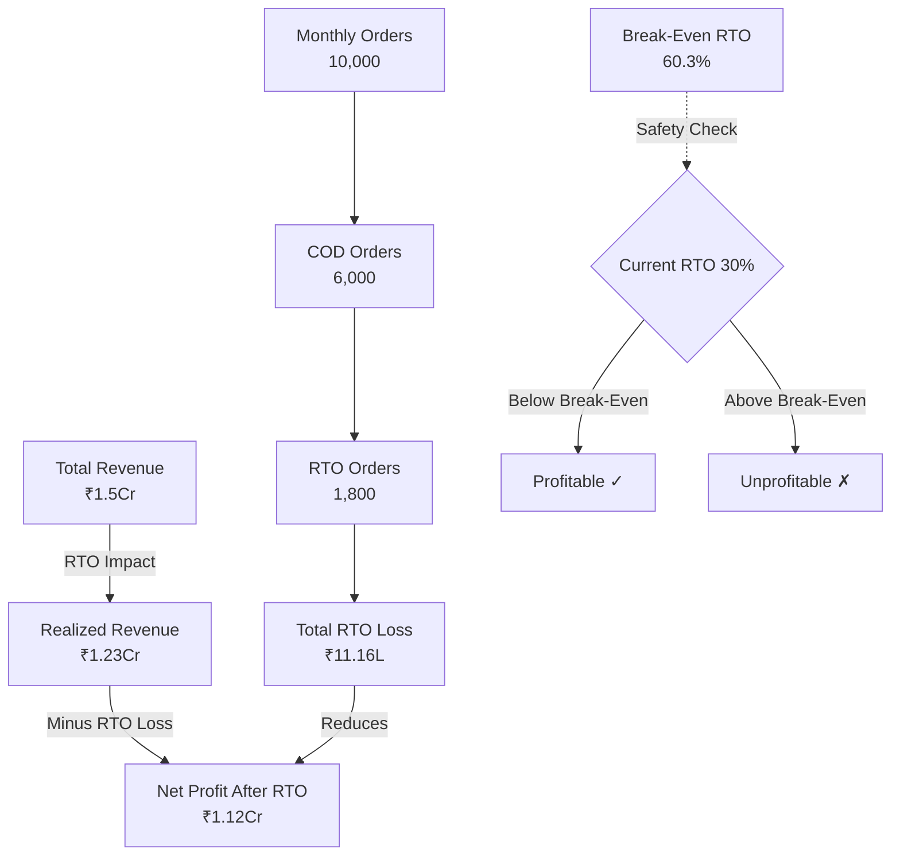

## Overview of Calculated Metrics

The RTO Profit Simulator calculates seven key metrics based on your inputs. Each metric provides critical insights into your business performance and RTO impact. This guide explains each metric in detail based on the calculation logic in `src/utils/calculations.js`.

<Info>
All metrics are calculated for **monthly** view by default. Toggle to **Annual Projection** to see metrics multiplied by 12 for yearly planning.
</Info>

## Input Parameters

Before diving into calculated metrics, let's understand the input parameters that drive all calculations:

### Core Business Inputs

<AccordionGroup>
  <Accordion title="Monthly Orders">
    **What it is**: Total number of orders you process per month across all payment methods.
    
    **Default**: 10,000 orders
    
    **How to determine yours**:
    - Check your e-commerce dashboard
    - Use average from last 3 months for consistency
    - Exclude cancelled orders (only count dispatched orders)
    
    <Tip>
    For seasonal businesses, use peak season and off-season averages separately to understand variation.
    </Tip>
  </Accordion>

  <Accordion title="Average Order Value (AOV)">
    **What it is**: The average value of each order placed.
    
    **Default**: ₹1,500
    
    **Calculation**: Total Revenue / Total Orders
    
    **How to determine yours**:
    ```
    AOV = Total Monthly Revenue / Total Monthly Orders
    ```
    
    Example: If you made ₹50,00,000 from 5,000 orders:
    ```
    AOV = ₹50,00,000 / 5,000 = ₹1,000
    ```
  </Accordion>

  <Accordion title="COD Percentage">
    **What it is**: Percentage of total orders placed with Cash on Delivery payment method.
    
    **Default**: 60%
    
    **How to determine yours**:
    ```
    COD % = (COD Orders / Total Orders) × 100
    ```
    
    <Note>
    **Industry benchmarks**:
    - Tier 1 cities: 30-50% COD
    - Tier 2/3 cities: 60-80% COD
    - Rural areas: 80-90% COD
    </Note>
  </Accordion>

  <Accordion title="RTO Percentage">
    **What it is**: Percentage of COD orders that result in Return to Origin (not delivered).
    
    **Default**: 30%
    
    **How to determine yours**:
    ```
    RTO % = (RTO Orders / Total COD Orders) × 100
    ```
    
    **Get this data from**:
    - Shipping partner dashboard
    - Logistics reports (look for "RTO", "Failed Delivery", or "Returned" status)
    - Your order management system
    
    <Warning>
    This is **RTO as % of COD orders**, not % of total orders. If you have 1,000 COD orders and 250 RTOs, your RTO % is 25%, not 2.5%.
    </Warning>
  </Accordion>

  <Accordion title="Forward Shipping Cost">
    **What it is**: Cost to ship each order from your warehouse to the customer.
    
    **Default**: ₹60 per order
    
    **How to determine yours**:
    - Check your logistics partner rate card
    - Use average if you have zone-based pricing
    - Include pickup charges if applicable
    
    <Tip>
    If your shipping cost varies significantly by zone:
    - Local: ₹40
    - Regional: ₹60  
    - National: ₹80
    
    Use a weighted average based on your typical order distribution.
    </Tip>
  </Accordion>

  <Accordion title="Return Shipping Cost">
    **What it is**: Cost charged by logistics partner to return the product from delivery location back to your warehouse.
    
    **Default**: ₹60 per RTO
    
    **How to determine yours**:
    - Check your logistics contract for RTO charges
    - Often equal to or slightly less than forward shipping
    - Some partners charge flat RTO rates
    
    <Note>
    Many logistics partners charge **higher** RTO rates as a penalty/deterrent. Negotiate this rate down as part of your logistics contract.
    </Note>
  </Accordion>

  <Accordion title="Product Cost per Order">
    **What it is**: The cost of the product being sold (COGS - Cost of Goods Sold).
    
    **Default**: ₹500 per order
    
    **How to determine yours**:
    - For single-product businesses: Your product manufacturing/purchase cost
    - For multi-product: Average product cost across your catalog
    - Include: Raw materials, manufacturing, packaging
    
    **Interpretation for RTO**:
    
    In RTO context, this represents the **opportunity cost** or actual cost:
    - Product blocked in logistics cycle (couldn't sell to others)
    - Potential damage during forward + return journey
    - Repackaging costs to make resaleable
    - For perishables/fashion: May become unsellable (100% loss)
    
    <Warning>
    For high-value products (electronics, jewelry), this is your largest RTO cost component. For low-value products (apparel, accessories), shipping costs dominate.
    </Warning>
  </Accordion>
</AccordionGroup>

## Calculated Metrics Explained

### 1. Total Revenue

**Formula** (from `src/utils/calculations.js:12`):
```javascript
Total Revenue = Monthly Orders × Average Order Value
```

**Default Example**:
```text
Total Revenue = 10,000 × ₹1,500 = ₹1,50,00,000/month
Annual: ₹18,00,00,000
```

**What it tells you**:
- This is your **gross revenue** if all orders were successfully delivered
- Represents the maximum possible revenue
- Does NOT account for RTO losses or costs

**Business insight**:
<Note>
This is an aspirational number. Your **actual realized revenue** will be lower due to RTOs. The gap between Total Revenue and Realized Revenue shows the direct revenue loss from failed deliveries.
</Note>

**Displayed in**: Financial Impact Overview (first metric card)

---

### 2. COD Orders

**Formula** (from `src/utils/calculations.js:14`):
```javascript
COD Orders = Round(Monthly Orders × (COD Percentage / 100))
```

**Default Example**:
```text
COD Orders = 10,000 × (60 / 100) = 6,000 orders/month
Annual: 72,000 orders
```

**What it tells you**:
- Absolute number of orders placed with COD payment method
- This is your **high-risk order pool** (where RTO can occur)
- Prepaid orders = Total Orders - COD Orders

**Business insight**:
<Info>
The higher your COD order count, the higher your exposure to RTO risk. This metric helps you understand the scale of orders that need monitoring, verification, and RTO prevention efforts.
</Info>

**Displayed in**: Financial Impact Overview (second metric card)

---

### 3. RTO Orders

**Formula** (from `src/utils/calculations.js:17`):
```javascript
RTO Orders = Round(COD Orders × (RTO Percentage / 100))
```

**Default Example**:
```text
RTO Orders = 6,000 × (30 / 100) = 1,800 orders/month
Annual: 21,600 orders
```

**What it tells you**:
- Absolute number of orders that failed delivery and returned
- Each of these orders costs you money in three ways (forward + return shipping + product cost)
- Successfully delivered COD orders = COD Orders - RTO Orders = 4,200

**Business insight**:
<Warning>
**1,800 RTO orders/month** means:
- 1,800 customer relationships failed
- 1,800 products went on a useless journey
- 1,800 opportunities to improve your process

This number should be your primary KPI for logistics and customer verification teams.
</Warning>

**Displayed in**: Financial Impact Overview (third metric card, highlighted in red)

---

### 4. Total RTO Loss

**Formula** (from `src/utils/calculations.js:20-24`):
```javascript
RTO Loss per Order = Forward Shipping + Return Shipping + Product Cost
Total RTO Loss = RTO Orders × RTO Loss per Order
```

**Default Example**:
```text
RTO Loss per Order = ₹60 + ₹60 + ₹500 = ₹620
Total RTO Loss = 1,800 × ₹620 = ₹11,16,000/month
Annual: ₹1,33,92,000
```

**What it tells you**:
- **Direct monetary loss** due to RTO
- This money is completely unrecoverable (pure loss)
- Does not include indirect costs (customer service, warehouse operations, etc.)

**Cost breakdown**:
| Cost Component | Per RTO Order | Monthly (1,800 RTOs) | Annual |
|----------------|---------------|----------------------|--------|
| Forward Shipping | ₹60 | ₹1,08,000 | ₹12,96,000 |
| Return Shipping | ₹60 | ₹1,08,000 | ₹12,96,000 |
| Product Cost | ₹500 | ₹9,00,000 | ₹1,08,00,000 |
| **TOTAL** | **₹620** | **₹11,16,000** | **₹1,33,92,000** |

**Business insight**:
<Warning>
**Critical**: This is pure cash burn. Unlike marketing spend (which brings customers) or inventory investment (which can be sold), RTO loss generates zero value. Reducing this number should be a top priority.
</Warning>

**Displayed in**: Financial Impact Overview (fourth metric card, highlighted in red)

---

### 5. Realized Revenue (Net Realized Revenue)

**Formula** (from `src/utils/calculations.js:26-27`):
```javascript
Prepaid Orders = Total Orders - COD Orders
Delivered COD Orders = COD Orders - RTO Orders
Realized Revenue = (Prepaid Orders + Delivered COD Orders) × AOV
```

**Default Example**:
```text
Prepaid Orders = 10,000 - 6,000 = 4,000
Delivered COD Orders = 6,000 - 1,800 = 4,200
Total Delivered = 4,000 + 4,200 = 8,200 orders

Realized Revenue = 8,200 × ₹1,500 = ₹1,23,00,000/month
Annual: ₹14,76,00,000
```

**What it tells you**:
- **Actual revenue** from successfully delivered orders
- Money you actually received (prepaid) or will receive (delivered COD)
- This is **not profit** - costs still need to be deducted

**Comparison with Total Revenue**:
```text
Total Revenue: ₹1,50,00,000 (what you could have made)
Realized Revenue: ₹1,23,00,000 (what you actually made)
Revenue Loss: ₹27,00,000 (18% revenue lost to RTO)
```

**Business insight**:
<Info>
**Realized Revenue** is your real top-line. The gap between Total Revenue and Realized Revenue shows the **opportunity cost** of RTO - revenue you should have earned but didn't due to failed deliveries.

In this example, **18% of potential revenue** is lost to RTO.
</Info>

**Displayed in**: Financial Impact Overview (fifth metric card)

---

### 6. Net Profit After RTO

**Formula** (from `src/utils/calculations.js:29-35`):
```javascript
Net Profit After RTO = Realized Revenue - Total RTO Loss
```

**Default Example**:
```text
Net Profit After RTO = ₹1,23,00,000 - ₹11,16,000 = ₹11,84,000/month
Annual: ₹14,20,80,000
```

**What it tells you**:
- **Net revenue** after accounting for RTO losses
- This is not true "profit" in accounting terms (doesn't deduct all operational costs)
- Better termed as "Revenue minus RTO Impact"

**Important clarification**:
<Note>
This metric shows the **financial impact of RTO specifically**. It does NOT include:
- Product costs for delivered orders
- Forward shipping for delivered orders  
- Other operational costs (rent, salaries, marketing, etc.)

Think of it as: **How much revenue do you have left after RTO costs to cover your other business expenses?**
</Note>

**Business insight**:
<Tip>
Use this metric to understand RTO's impact on your business health:
- If declining month-over-month: RTO is getting worse
- Compare with previous months to track improvement
- Set targets: "Increase Net Profit After RTO by 15% through RTO reduction"
</Tip>

**Displayed in**: Financial Impact Overview (sixth metric card, highlighted in blue)

---

### 7. Break-Even RTO Percentage

**Formula** (from `src/utils/calculations.js:38-44`):
```javascript
Profit per Successful Order = AOV - Product Cost - Forward Shipping
Loss per RTO Order = Product Cost + Forward Shipping + Return Shipping

Break-Even RTO % = (Profit per Successful Order / 
                    (Profit per Successful Order + Loss per RTO Order)) × 100
```

**Default Example**:
```text
Profit per Successful Order = ₹1,500 - ₹500 - ₹60 = ₹940
Loss per RTO Order = ₹500 + ₹60 + ₹60 = ₹620

Break-Even RTO % = (₹940 / (₹940 + ₹620)) × 100
                 = (₹940 / ₹1,560) × 100
                 = 60.3%
```

**What it tells you**:
- The **maximum sustainable RTO rate** before you start losing money
- At this RTO percentage, profit from successful orders exactly equals loss from RTO orders
- Above this percentage: **Net loss** (unsustainable business)
- Below this percentage: **Net profit** (sustainable business)

**Visual indicator in app**:

The simulator displays this prominently with a circular progress indicator:

- **Green zone** (Current RTO < Break-Even): "Within safe profitability range"
- **Red zone** (Current RTO > Break-Even): "Current RTO exceeds sustainable threshold"

**Business insight**:
<Warning>
**Critical Decision Tool**:

| Your Situation | Action Required |
|----------------|----------------|
| RTO < Break-Even by 20%+ | Healthy - Focus on growth |
| RTO < Break-Even by 10-20% | Monitor - Room for improvement |
| RTO < Break-Even by 0-10% | Caution - Small buffer, optimize urgently |
| RTO > Break-Even | **CRITICAL** - Losing money on every marginal order |
</Warning>

**Example scenarios with same defaults**:

| Scenario | Current RTO | Break-Even RTO | Status | Interpretation |
|----------|-------------|----------------|---------|----------------|
| Healthy | 20% | 60.3% | ✅ Green | 40.3% safety buffer |
| Risky | 50% | 60.3% | ⚠️ Yellow | Only 10.3% buffer |
| **Default** | **30%** | **60.3%** | ✅ **Green** | **30.3% buffer** |
| Critical | 65% | 60.3% | 🚨 Red | Operating at loss |

**How it changes with different parameters**:

<Accordion title="Higher Product Cost → Lower Break-Even RTO">
If product cost increases to ₹800:
```text
Profit per Order = ₹1,500 - ₹800 - ₹60 = ₹640
Loss per RTO = ₹800 + ₹60 + ₹60 = ₹920
Break-Even = ₹640 / (₹640 + ₹920) × 100 = 41%
```
**Result**: Break-even drops from 60.3% to 41% - less tolerance for RTO.
</Accordion>

<Accordion title="Higher AOV → Higher Break-Even RTO">
If AOV increases to ₹2,500:
```text
Profit per Order = ₹2,500 - ₹500 - ₹60 = ₹1,940
Loss per RTO = ₹500 + ₹60 + ₹60 = ₹620
Break-Even = ₹1,940 / (₹1,940 + ₹620) × 100 = 75.8%
```
**Result**: Break-even increases to 75.8% - can absorb higher RTO due to better margins.
</Accordion>

<Accordion title="Lower Shipping Costs → Higher Break-Even RTO">
If shipping costs drop to ₹40 each:
```text
Profit per Order = ₹1,500 - ₹500 - ₹40 = ₹960
Loss per RTO = ₹500 + ₹40 + ₹40 = ₹580
Break-Even = ₹960 / (₹960 + ₹580) × 100 = 62.3%
```
**Result**: Break-even increases slightly to 62.3% - shipping optimization helps RTO tolerance.
</Accordion>

**Displayed in**: Prominent Break-Even card below the main metrics grid

---

## How Metrics Relate to Each Other

### The RTO Impact Chain



### Key Metric Relationships

<AccordionGroup>
  <Accordion title="Revenue Gap = Total Revenue - Realized Revenue">
    ```
    ₹1,50,00,000 - ₹1,23,00,000 = ₹27,00,000/month
    ```
    This ₹27L is the **opportunity cost** of RTO - revenue you should have earned from those 1,800 failed deliveries.
  </Accordion>

  <Accordion title="RTO Loss % of Total Revenue">
    ```
    (Total RTO Loss / Total Revenue) × 100
    (₹11,16,000 / ₹1,50,00,000) × 100 = 7.44%
    ```
    In this example, **7.44% of total revenue** is lost to RTO costs.
  </Accordion>

  <Accordion title="Effective RTO % (of all orders)">
    ```
    (RTO Orders / Total Orders) × 100
    (1,800 / 10,000) × 100 = 18%
    ```
    While RTO is 30% of COD orders, it's 18% of total orders (because only 60% are COD).
  </Accordion>

  <Accordion title="Delivery Success Rate">
    ```
    (Realized Orders / Total Orders) × 100
    (8,200 / 10,000) × 100 = 82%
    ```
    Your overall delivery success rate is 82%.
  </Accordion>
</AccordionGroup>

## Using Metrics for Business Decisions

### Decision 1: Should I Invest in RTO Reduction?

<Steps>
  <Step title="Check your Total RTO Loss">
    Monthly: ₹11,16,000  
    Annual: ₹1,33,92,000
  </Step>
  
  <Step title="Use the Simulation Section">
    Model a 10% RTO reduction (from 30% to 20%):
    - Potential monthly savings: ₹3,72,000
    - Annual savings: ₹44,64,000
  </Step>
  
  <Step title="Calculate ROI">
    If an OTP verification system costs ₹2,00,000/year:
    ```
    Annual Savings: ₹44,64,000
    System Cost: ₹2,00,000
    Net Benefit: ₹42,64,000
    ROI: 2,132%
    ```
    **Clear YES - invest immediately!**
  </Step>
</Steps>

### Decision 2: Should I Reduce COD Percentage?

<Steps>
  <Step title="Check current COD Orders">
    6,000 COD orders out of 10,000 total (60%)
  </Step>
  
  <Step title="Use Prepaid Comparison Section">
    Model reducing COD to 50%:
    - New COD orders: 5,000
    - RTO orders: 1,500 (down from 1,800)
    - RTO savings: ₹1,86,000/month
  </Step>
  
  <Step title="Consider tradeoffs">
    **Benefit**: ₹1,86,000/month savings from lower RTO  
    **Risk**: May lose customers who can only pay COD  
    
    **Decision**: If 5% prepaid discount can convert 1,000 COD customers, cost is:
    ```
    5% of ₹1,500 × 1,000 orders = ₹75,000
    Net gain: ₹1,86,000 - ₹75,000 = ₹1,11,000/month
    ```
    **YES - offer prepaid discounts!**
  </Step>
</Steps>

### Decision 3: Am I at Risk?

<Check>**Current RTO (30%)** is **below** Break-Even RTO (60.3%) ✅</Check>
<Check>RTO Loss is 7.44% of revenue (acceptable) ✅</Check>
<Check>Net Profit After RTO is positive (₹11.84L/month) ✅</Check>

**Verdict**: Business is profitable but has significant optimization opportunity. Prioritize RTO reduction to improve margins.

---

## AI-Powered Insights Explained

The simulator includes an **AI Insights** section that automatically analyzes your metrics and provides recommendations. Here's how it works (based on `src/components/AIInsights.jsx`):

### Insight 1: RTO Rate Assessment

<Accordion title="Critical RTO Alert (RTO > 25%)">
**Trigger**: Your RTO percentage exceeds 25%

**Message**: 
> Your RTO rate is 30%, which is dangerously high. It is significantly eating into your margins, costing you ₹11,16,000 monthly.

**Action**: Immediate intervention required - implement verification systems.
</Accordion>

<Accordion title="Healthy RTO Rate (RTO ≤ 15%)">
**Trigger**: Your RTO percentage is 15% or below

**Message**:
> Your RTO rate of 12% is well within the healthy industry benchmark (< 20%). Keep it up!

**Action**: Maintain current processes, focus on scaling.
</Accordion>

### Insight 2: Unprofitable Operation Alert

<Accordion title="Above Break-Even Warning">
**Trigger**: Current RTO > Break-Even RTO

**Message**:
> Your current RTO (35%) exceeds your break-even RTO (30.5%). Every RTO order is causing a net loss per processed order. Immediate intervention required.

**Action**: **CRITICAL** - Your business model is unsustainable at current RTO levels.
</Accordion>

### Insight 3: Partial COD Suggestion

<Accordion title="High COD + High RTO Combination">
**Trigger**: COD > 40% AND RTO > 15%

**Message**:
> Since 60% of your orders are COD, consider charging a small non-refundable advance (Partial COD) for high-risk pin codes. Also, implement NDR management with OTP verification.

**Action**: Implement partial COD (10-20% advance) and NDR processes.
</Accordion>

### Insight 4: Prepaid Incentive Opportunity

<Accordion title="Prepaid Conversion Potential">
**Trigger**: COD > 20%

**Calculation**: Simulates 10% COD reduction and calculates profit improvement

**Message**:
> If you offer a 5% discount on prepaid orders and successfully convert 10% of COD orders to prepaid, your Net Profit increases by ₹89,000 due to reduced RTO volume.

**Action**: Design prepaid incentive program (discounts, cashback, faster delivery).
</Accordion>

---

## Key Takeaways

<CardGroup cols={2}>
  <Card title="Focus on RTO Orders" icon="crosshairs">
    This absolute number shows scale of the problem - every RTO is a failed transaction
  </Card>
  
  <Card title="Monitor Total RTO Loss" icon="money-bill-trend-up">
    Direct monthly/annual cash loss - should be your primary cost-reduction KPI
  </Card>
  
  <Card title="Respect Break-Even RTO %" icon="scale-balanced">
    Your profitability threshold - never let current RTO exceed this
  </Card>
  
  <Card title="Track Realized Revenue" icon="chart-line">
    Your actual earning power after RTO impact - use for realistic forecasting
  </Card>
</CardGroup>

<Tip>
**Pro Tip**: Set up a monthly review routine:
1. Input current month's data
2. Compare metrics with last month
3. Check if RTO % is increasing (red flag!)
4. Review Total RTO Loss trend
5. Ensure Current RTO stays well below Break-Even
</Tip>

## Next Steps

<Card title="Learn Optimization Strategies" icon="lightbulb" href="/guides/optimization-strategies">
  Now that you understand the metrics, discover practical strategies to improve them
</Card>
