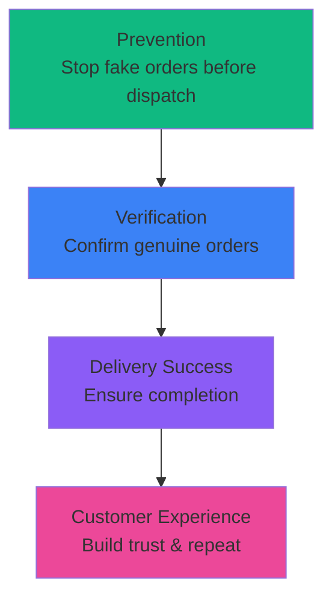

## Why RTO Optimization Matters

Based on the default scenario in the RTO Profit Simulator, reducing RTO from **30% to 20%** (a 10-point reduction) saves **₹3,72,000/month** or **₹44,64,000/year**. This guide provides proven strategies to achieve these reductions.

<Info>
Use the **Simulation Section** in the RTO Profit Simulator to model the financial impact of each strategy for your specific business before implementing.
</Info>

## Strategy Framework: The RTO Reduction Pyramid



## Prevention Strategies (Before Dispatch)

### 1. OTP-Based Order Confirmation

**What it is**: Send an OTP to customer's mobile number immediately after COD order placement. Dispatch only after OTP verification.

**How it reduces RTO**:
- Confirms customer has access to registered mobile number
- Filters out fake phone numbers
- Creates psychological commitment
- Typical RTO reduction: **5-10%**

**Implementation**:
<Steps>
  <Step title="Choose OTP Provider">
    - SMS Gateway: MSG91, Twilio, Gupshup
    - Cost: ₹0.20-0.30 per SMS
    - Integration: Simple API
  </Step>
  
  <Step title="Set Up Workflow">
    ```
    Order Placed → Send OTP → Wait 1 hour → Resend if not verified → 
    Cancel order if not verified in 6 hours
    ```
  </Step>
  
  <Step title="User Experience">
    - Show clear instructions on thank you page
    - Send OTP within 30 seconds
    - Allow 3 retry attempts
    - Provide customer support number if issues
  </Step>
</Steps>

**Cost-Benefit Analysis** (using simulator defaults):
```text
Monthly COD Orders: 6,000
OTP Cost: ₹0.25 per order
Monthly OTP Cost: 6,000 × ₹0.25 = ₹1,500

RTO Reduction: 7% (from 30% to 23%)
Monthly Savings: ₹2,60,400

Net Benefit: ₹2,60,400 - ₹1,500 = ₹2,58,900/month
ROI: 17,260%
```

<Tip>
**Best Practice**: Implement OTP for all COD orders above ₹1,000 or for first-time customers. For repeat customers with good delivery history, you can skip OTP.
</Tip>

---

### 2. IVR Call Verification

**What it is**: Make an automated call to customer asking them to confirm the order by pressing a number.

**How it reduces RTO**:
- Stronger verification than SMS (harder to fake)
- Confirms customer is serious about purchase
- Can be done in customer's preferred language
- Typical RTO reduction: **8-12%**

**Implementation**:
<Steps>
  <Step title="Choose IVR Provider">
    - Exotel, Knowlarity, Ozonetel
    - Cost: ₹0.50-1.00 per call
  </Step>
  
  <Step title="Call Script">
    ```
    "Hello, you have placed an order for [product name] worth ₹[amount] 
    from [your brand]. To confirm, press 1. To cancel, press 2."
    ```
  </Step>
  
  <Step title="Call Timing">
    - Make call within 15 minutes of order
    - If no answer, retry after 2 hours
    - Maximum 3 attempts
    - Cancel order if not confirmed in 8 hours
  </Step>
</Steps>

**When to use**:
- High-value orders (₹2,000+)
- First-time customers
- High-risk pin codes
- Previous RTO customers

<Warning>
**Conversion Impact**: IVR can feel intrusive and may reduce conversion by 5-10% if applied to all orders. Use selectively based on risk scoring.
</Warning>

---

### 3. Address Verification

**What it is**: Validate customer address using AI/ML tools or manual calling before dispatch.

**How it reduces RTO**:
- Catches incomplete/incorrect addresses
- Identifies non-existent landmarks
- Confirms customer availability at address
- Typical RTO reduction: **3-5%**

**Implementation Options**:

<Accordion title="Automated Address Validation (AI/ML)">
**Tools**: Google Address Validation API, Loqate, SmartyStreets

**Process**:
1. API checks address against postal database
2. Flags incomplete/incorrect addresses
3. Suggests corrections
4. Manual review for flagged addresses

**Cost**: ₹2-5 per validation

**Best for**: High-volume businesses (>5,000 orders/month)
</Accordion>

<Accordion title="Manual Address Verification Call">
**Process**:
1. Operations team calls customer
2. Confirms address details and landmarks
3. Confirms delivery timing preference
4. Updates order with verified information

**Cost**: ₹15-20 per call (outsourced) or team salary

**Best for**: High-value orders or chronic RTO problems
</Accordion>

<Accordion title="Address Quality Scoring at Checkout">
**Process**:
1. Real-time validation during checkout
2. Show warnings for incomplete addresses
3. Force mandatory landmark for Tier 2/3 cities
4. Suggest address from Google Maps API

**Cost**: Minimal (frontend validation)

**Best for**: All businesses - implement immediately!
</Accordion>

---

### 4. Risk-Based Pin Code Management

**What it is**: Analyze RTO rates by pin code and take action on high-risk areas.

**How it reduces RTO**:
- Disable COD for chronically high-RTO pin codes
- Require partial payment for risky areas
- Focus verification efforts on risky zones
- Typical RTO reduction: **5-8%**

**Implementation**:

<Steps>
  <Step title="Analyze Historical Data">
    Export 6 months of orders and calculate RTO % by pin code:
    
    ```sql
    SELECT 
      pin_code,
      COUNT(*) as total_orders,
      SUM(CASE WHEN status = 'RTO' THEN 1 ELSE 0 END) as rto_orders,
      (SUM(CASE WHEN status = 'RTO' THEN 1 ELSE 0 END) * 100.0 / COUNT(*)) as rto_percentage
    FROM orders
    WHERE payment_method = 'COD'
      AND dispatch_date >= DATE_SUB(NOW(), INTERVAL 6 MONTH)
    GROUP BY pin_code
    HAVING total_orders >= 10
    ORDER BY rto_percentage DESC;
    ```
  </Step>
  
  <Step title="Categorize Pin Codes">
    | RTO Rate | Category | Action |
    |----------|----------|--------|
    | 0-15% | Low Risk | Standard process |
    | 15-25% | Medium Risk | OTP verification |
    | 25-40% | High Risk | IVR call + OTP |
    | >40% | Very High Risk | Disable COD or partial payment |
  </Step>
  
  <Step title="Implement Pin Code Rules">
    In your checkout:
    ```javascript
    if (pinCode in highRiskPinCodes) {
      if (orderValue > 1000) {
        disableCOD();
        showMessage("COD not available for this location");
      } else {
        requirePartialPayment(20); // 20% advance
      }
    }
    ```
  </Step>
  
  <Step title="Review Monthly">
    - Add new high-RTO pin codes to risk list
    - Remove pin codes that have improved
    - Communicate with customers in affected areas about policy
  </Step>
</Steps>

<Note>
**Data Requirement**: Need at least 10 orders per pin code for statistical significance. For new pin codes, use zone/city level data.
</Note>

---

### 5. Partial COD (Advance Payment)

**What it is**: Require customers to pay 10-30% of order value upfront for COD orders.

**How it reduces RTO**:
- Creates financial commitment
- Filters out non-serious buyers
- Reduces fraud orders to zero (if advance is non-refundable)
- Typical RTO reduction: **15-25%**

**Implementation Models**:

<Accordion title="Model 1: Universal Partial COD">
**Policy**: All COD orders require 20% advance

**Example**: ₹1,500 order → Pay ₹300 online, ₹1,200 at delivery

**Pros**:
- Dramatic RTO reduction
- Immediate cash flow improvement
- Simple to implement

**Cons**:
- May lose customers who can't pay online
- Reduces COD appeal

**Best for**: Premium brands with brand loyalty
</Accordion>

<Accordion title="Model 2: Selective Partial COD">
**Policy**: Require advance only for:
- Orders above ₹2,000
- High-risk pin codes
- First-time customers
- Customers with previous RTO

**Pros**:
- Targeted approach
- Minimal impact on genuine customers
- Maintains COD option for low-risk orders

**Cons**:
- More complex to implement
- Requires customer segmentation

**Best for**: Most D2C brands - **recommended approach**
</Accordion>

<Accordion title="Model 3: Shipping Fee as Advance">
**Policy**: Collect shipping fee (₹50-100) as advance, refundable on delivery

**Example**: Pay ₹60 shipping online, refunded if order is accepted

**Pros**:
- Customers perceive it as shipping charge, not partial payment
- Covers shipping costs if RTO occurs
- Psychologically easier to accept

**Cons**:
- Lower commitment than % of order value
- Refund process adds operational overhead

**Best for**: Testing partial COD concept
</Accordion>

**Impact Simulation** (using RTO Profit Simulator defaults):

```text
Scenario: Implement 20% partial COD, expecting RTO to drop from 30% to 15%

Before:
- RTO Orders: 1,800/month
- RTO Loss: ₹11,16,000/month

After:
- RTO Orders: 900/month  
- RTO Loss: ₹5,58,000/month

Monthly Savings: ₹5,58,000
Annual Savings: ₹66,96,000

But: May lose 10% of COD orders who can't/won't pay online
Lost Orders: 600/month
Lost Revenue: ₹9,00,000/month (if no conversion to prepaid)

Net Impact: Need to analyze if ₹5.58L savings > ₹9L lost revenue
```

<Tip>
**Recommendation**: Start with Model 2 (Selective Partial COD) for high-risk segments only. Monitor conversion impact closely. Most businesses see net positive results.
</Tip>

---

## Verification Strategies (Post-Order, Pre-Dispatch)

### 6. NDR (Non-Delivery Report) Management

**What it is**: Proactive process to rescue orders when first delivery attempt fails.

**How it reduces RTO**:
- Gives customer second chance to receive order
- Identifies and fixes delivery issues
- Converts potential RTOs to successful deliveries
- Typical RTO reduction: **3-5%**

**NDR Workflow**:

<Steps>
  <Step title="Receive NDR from Logistics Partner">
    Common NDR reasons:
    - Customer not available
    - Address incomplete/incorrect
    - Customer refused
    - Payment issue (customer didn't have cash)
    - Rescheduling requested
  </Step>
  
  <Step title="Immediate Customer Outreach (within 2 hours)">
    - Call customer to understand issue
    - WhatsApp message with order status
    - SMS with tracking link
    
    **Script**: 
    ```
    "Hi [Name], your order #[ID] couldn't be delivered because [reason]. 
    We'd like to reattempt delivery. Please confirm your availability 
    and address."
    ```
  </Step>
  
  <Step title="Take Action Based on Response">
    | Customer Response | Action |
    |------------------|--------|
    | Will accept, address correct | Reattempt next day |
    | Address incorrect | Update address, reattempt |
    | Not available today | Schedule preferred date |
    | Changed mind | Try to save order with discount |
    | Fake number / No response | Mark as RTO after 2 attempts |
  </Step>
  
  <Step title="Maximum 2 Reattempts">
    - First reattempt: Next working day
    - Second reattempt: 2 days later
    - If both fail: RTO
  </Step>
</Steps>

**Tools for NDR Management**:
- **Manual**: Google Sheets + calling team
- **Automated**: Shiprocket, ShipStation, Shipway (built-in NDR management)
- **Advanced**: Pickrr, Clickpost (AI-powered NDR recovery)

**Cost**: ₹5-10 per NDR case (if outsourced)

<Info>
**Success Rate**: Well-managed NDR processes convert **30-50%** of potential RTOs into successful deliveries.

Example: 1,800 RTO orders → 900 are genuine NDR (customer unavailable/address issue) → 450 can be rescued = **25% RTO reduction on these orders**.
</Info>

---

### 7. Customer Communication Sequence

**What it is**: Multi-touchpoint communication before and during delivery.

**How it reduces RTO**:
- Keeps customer engaged and excited
- Reminds customer about order
- Confirms availability
- Typical RTO reduction: **2-4%**

**Recommended Sequence**:

<Steps>
  <Step title="Order Confirmation (Immediate)">
    **Channel**: Email + SMS + WhatsApp
    
    **Message**: 
    ```
    Thanks for your order! 🎉
    Order #[ID] for [product] will be delivered in 4-5 days.
    Track: [link]
    ```
  </Step>
  
  <Step title="Dispatch Notification (When shipped)">
    **Channel**: SMS + WhatsApp
    
    **Message**:
    ```
    Great news! Your order is on the way! 📦
    Expected delivery: [date]
    Please keep ₹[amount] cash ready.
    Track: [link]
    ```
  </Step>
  
  <Step title="Out for Delivery (Morning of delivery day)">
    **Channel**: SMS + WhatsApp + Call (optional)
    
    **Message**:
    ```
    Your order will be delivered TODAY between 10 AM - 6 PM.
    Please ensure someone is available at [address].
    Delivery partner will call before arriving.
    Keep ₹[amount] cash ready.
    ```
  </Step>
  
  <Step title="Delivery Partner Assigned (30 min before delivery)">
    **Channel**: SMS
    
    **Message**:
    ```
    [Delivery Partner Name] is on the way to deliver your order.
    Contact: [phone]
    Live tracking: [link]
    ```
  </Step>
</Steps>

**WhatsApp Best Practices**:
- Use WhatsApp Business API for automated messages
- Include product image in dispatch notification
- Enable two-way communication (customer can respond)
- Use order tracking chatbot

<Tip>
**Pro Tip**: Send a "Pre-Delivery Confirmation" message 1 hour before estimated delivery asking customer to reply YES if they're available. If they don't respond or say NO, contact them immediately to reschedule.
</Tip>

---

## Delivery Success Strategies (During Delivery)

### 8. Smart Delivery Scheduling

**What it is**: Let customers choose delivery time slot.

**How it reduces RTO**:
- Ensures customer is available
- Reduces "not at home" RTOs
- Improves customer experience
- Typical RTO reduction: **4-7%**

**Implementation**:

<Accordion title="Basic: Preferred Time Collection">
At checkout, ask:
```text
Preferred delivery time:
[ ] Morning (10 AM - 1 PM)
[ ] Afternoon (1 PM - 5 PM)  
[ ] Evening (5 PM - 8 PM)
```

Pass this preference to logistics partner in shipping label notes.
</Accordion>

<Accordion title="Advanced: Slot-Based Delivery">
Integrate with logistics partners offering slot delivery:
- Delhivery, Shadowfax, Dunzo (metros)
- Show real slots during checkout
- Charge premium for specific slots

Example:
```text
[ ] Standard Delivery (Free) - 3-5 days, anytime
[ ] Scheduled Delivery (+₹30) - Choose date & time
```
</Accordion>

<Accordion title="Pro: Same-Day / Next-Day with Slots">
For metros/top cities:
- Same-day delivery in 2-4 hour slots
- Next-day delivery with morning/evening choice
- Significantly reduces RTO due to immediacy

Partners: Dunzo, Shadowfax, WeFast
</Accordion>

---

### 9. Flexible Payment Options at Doorstep

**What it is**: Allow customer to pay via UPI/card at delivery instead of cash.

**How it reduces RTO**:
- Eliminates "don't have cash" RTO reason
- Convenient for customers
- Reduces cash handling for delivery partners
- Typical RTO reduction: **2-3%**

**Implementation**:
- Partner with Dunzo, Shadowfax (built-in mPOS)
- Provide delivery partners with payment terminals
- Enable UPI QR code on delivery

**Customer Communication**:
```text
You can pay via:
💵 Cash
📱 UPI (Google Pay, PhonePe, Paytm)
💳 Card (swipe machine available)
```

---

### 10. Packaging Quality

**What it is**: Professional, secure packaging that creates excitement.

**How it reduces RTO**:
- First impression matters at doorstep
- Reduces customer doubt about product authenticity
- Prevents damage-related refusals
- Typical RTO reduction: **1-2%**

**Best Practices**:
<Check>Branded packaging with logo (builds trust)</Check>
<Check>Tamper-proof sealing (prevents theft/suspicion)</Check>
<Check>Bubble wrap for fragile items (prevents damage)</Check>
<Check>Include invoice and brand materials (looks professional)</Check>
<Check>QR code on package for easy returns if needed</Check>

---

## Prepaid Conversion Strategies

### 11. Prepaid Discounts

**What it is**: Offer discount/cashback for choosing prepaid payment.

**How it reduces RTO**:
- Converts COD orders to prepaid (which have less than 5% RTO)
- Reduces overall RTO percentage
- Improves cash flow
- Typical COD reduction: **10-20%**

**Discount Models**:

<Accordion title="Model 1: Flat Discount">
**Example**: "Get ₹100 OFF on prepaid orders"

**Best for**: High AOV businesses (₹1,500+)

**Calculation** (using simulator defaults):
```text
AOV: ₹1,500
Discount: ₹100 (6.67%)

If 10% of COD customers (600 orders) convert:
- Cost: 600 × ₹100 = ₹60,000
- RTO saved: 600 × 30% × ₹620 = ₹1,11,600
- Net benefit: ₹1,11,600 - ₹60,000 = ₹51,600/month
```

✅ **Positive ROI - implement!**
</Accordion>

<Accordion title="Model 2: Percentage Discount">
**Example**: "5% discount on prepaid orders"

**Best for**: Variable AOV businesses

**Auto-scales with order value**:
- ₹500 order → ₹25 discount
- ₹1,500 order → ₹75 discount
- ₹3,000 order → ₹150 discount
</Accordion>

<Accordion title="Model 3: Cashback">
**Example**: "Get ₹75 cashback as store credit on prepaid"

**Best for**: Building repeat customers

**Benefits**:
- Lower immediate cost (customer must return)
- Drives repeat purchase
- Can be higher value than discount (₹75 cashback vs ₹50 discount)
</Accordion>

**Use the RTO Profit Simulator's Prepaid Comparison Section** to model the exact impact for your business!

<Tip>
**Optimization**: Show prepaid discount prominently at checkout:
```text
💰 Save ₹100 - Pay online now!

[Pay Online - ₹1,400] ← Highlighted in green
[Cash on Delivery - ₹1,500]
```

A/B test different discount amounts to find optimal conversion.
</Tip>

---

### 12. Free Shipping on Prepaid

**What it is**: Absorb shipping cost for prepaid orders, charge for COD.

**How it reduces RTO**:
- Makes prepaid more attractive
- COD becomes expensive option
- Reduces COD percentage
- Typical COD reduction: **15-25%**

**Example Pricing**:
```text
🆓 Prepaid: Free Delivery
💵 COD: ₹60 delivery charges
```

**Financial Logic**:
```text
COD Order Cost: Forward ₹60 + Return ₹60 + 30% RTO probability
Expected Cost per COD Order: ₹60 + (30% × ₹60) = ₹78

If charging ₹60 for COD but offering free prepaid:
- Prepaid cost: ₹60 (just forward shipping, no RTO risk)
- COD cost: ₹78 - ₹60 charged = ₹18 net cost
- Break-even if conversion > 25%
```

---

## Customer Experience Strategies

### 13. Post-Delivery Experience

**What it is**: Ensure great experience after delivery to build trust for next order.

**How it reduces RTO** (future orders):
- Converts first-time COD customers to prepaid repeat customers
- Builds brand loyalty
- Reduces skepticism on next purchase

**Actions**:
<Check>Send thank you message immediately after delivery</Check>
<Check>Request product review after 3 days</Check>
<Check>Offer discount code for next prepaid order</Check>
<Check>Easy return process if needed (builds trust)</Check>
<Check>WhatsApp customer support</Check>

---

### 14. Customer Education

**What it is**: Proactively educate customers about RTO impact.

**Messaging Ideas**:
- "Please accept your order! Each RTO costs us ₹600 in shipping."
- "We're a small business. Refusing COD orders hurts us significantly."
- "Choose prepaid and get instant delivery tracking + priority shipping"

**Where to communicate**:
- Order confirmation email
- Product packaging inserts
- Thank you page after checkout
- Social media posts

---

## Using the RTO Profit Simulator for Strategy Planning

### Workflow: From Analysis to Action

<Steps>
  <Step title="Baseline Assessment">
    Input your current metrics:
    - Monthly Orders: [your number]
    - COD %: [your percentage]
    - RTO %: [your percentage]
    - Costs: [your shipping & product costs]
    
    Note your **Total RTO Loss** and **Break-Even RTO %**.
  </Step>
  
  <Step title="Identify Critical Metrics">
    Check:
    - Is RTO > 25%? 🚨 Critical
    - Is RTO > Break-Even? 🚨 Unprofitable
    - What is Total RTO Loss? This is your opportunity size
  </Step>
  
  <Step title="Use Simulation Section">
    Model different scenarios:
    - What if RTO drops 5%?
    - What if RTO drops 10%?
    - What if RTO drops 15%?
    
    The simulator shows **potential monthly savings** for each scenario.
  </Step>
  
  <Step title="Match Strategy to Goal">
    Based on your target RTO reduction:
    
    | Target | Strategy Combination |
    |--------|---------------------|
    | -5% RTO | OTP + Address Validation |
    | -10% RTO | OTP + IVR + NDR Management |
    | -15% RTO | OTP + IVR + Partial COD + Pin Code Management |
  </Step>
  
  <Step title="Calculate ROI">
    For each strategy:
    ```
    Monthly Savings (from simulator)
    - Strategy Cost
    = Net Benefit
    
    ROI = (Net Benefit / Strategy Cost) × 100
    ```
    
    Prioritize strategies with highest ROI.
  </Step>
  
  <Step title="Implement in Phases">
    **Phase 1 (Week 1-2)**: Quick wins
    - OTP verification
    - Improved address validation at checkout
    - NDR process
    
    **Phase 2 (Week 3-4)**: Moderate complexity
    - IVR for high-value orders
    - Pin code risk management
    - Prepaid discounts
    
    **Phase 3 (Month 2)**: Advanced
    - Partial COD for risky segments
    - Delivery slot selection
    - WhatsApp automation
  </Step>
  
  <Step title="Monitor & Iterate">
    - Update simulator with new data monthly
    - Track RTO % trend
    - Calculate actual savings vs projected
    - Adjust strategies based on results
  </Step>
</Steps>

---

## Real-World Results: Strategy Combinations

### Case Study 1: Fashion D2C Brand

**Before**:
- Monthly Orders: 8,000
- COD: 70%
- RTO: 35%
- Monthly RTO Loss: ₹15,40,000

**Strategies Implemented**:
1. OTP verification (all COD orders)
2. Partial COD 20% (orders >₹2,000)
3. 5% prepaid discount
4. NDR management with calling team

**After (3 months)**:
- COD: 55% (improved prepaid adoption)
- RTO: 22% (down from 35%)
- Monthly RTO Loss: ₹8,36,000

**Result**: ₹7,04,000/month savings (₹84,48,000/year)

---

### Case Study 2: Electronics Accessories

**Before**:
- Monthly Orders: 15,000
- COD: 65%
- RTO: 28%
- Monthly RTO Loss: ₹18,20,000

**Strategies Implemented**:
1. Pin code risk management (disabled COD for top 10 RTO pin codes)
2. IVR for first-time customers
3. Free shipping on prepaid
4. Same-day delivery in metros (prepaid only)

**After (4 months)**:
- COD: 48% (down due to pin code restrictions + prepaid incentives)
- RTO: 19% (better quality COD orders)
- Monthly RTO Loss: ₹9,12,000

**Result**: ₹9,08,000/month savings (₹1,08,96,000/year)

---

## Quick Reference: Strategy Effectiveness Matrix

| Strategy | RTO Reduction | Implementation Time | Cost | Difficulty |
|----------|---------------|-------------------|------|------------|
| **OTP Verification** | 5-10% | 1 week | Low | Easy |
| **IVR Calls** | 8-12% | 2 weeks | Medium | Medium |
| **Address Verification** | 3-5% | 1 week | Low-Medium | Easy |
| **Pin Code Management** | 5-8% | 2 weeks | Low | Medium |
| **Partial COD** | 15-25% | 1 week | Low | Easy |
| **NDR Management** | 3-5% | 2 weeks | Medium | Medium |
| **Prepaid Discounts** | N/A (converts) | 1 day | High | Easy |
| **Smart Scheduling** | 4-7% | 4 weeks | Medium | Hard |
| **Flexible Payment** | 2-3% | 4 weeks | High | Hard |

<Tip>
**Quick Win Priority**:
1. OTP Verification (week 1)
2. Prepaid Discount (week 1)  
3. Address Validation (week 1)
4. NDR Process (week 2)
5. Pin Code Management (week 3)

These 5 strategies can be implemented in 3 weeks and typically deliver **10-15% RTO reduction** combined.
</Tip>

---

## Measuring Success

### KPIs to Track

<AccordionGroup>
  <Accordion title="Primary: RTO Percentage">
    **Formula**: (RTO Orders / COD Orders) × 100
    
    **Target**: Below 20% (healthy), Below 15% (excellent)
    
    **Track**: Weekly, Monthly, Quarterly
  </Accordion>
  
  <Accordion title="Financial: Total RTO Loss">
    **Track in simulator**: Monthly RTO Loss
    
    **Goal**: Reduce by X% month-over-month
    
    **Report**: To finance team, investors
  </Accordion>
  
  <Accordion title="Operational: NDR Success Rate">
    **Formula**: (Rescued Orders / Total NDR Cases) × 100
    
    **Target**: >40%
    
    **Improvement**: Better NDR process
  </Accordion>
  
  <Accordion title="Customer: Prepaid %">
    **Formula**: (Prepaid Orders / Total Orders) × 100
    
    **Target**: Increase by 5% per quarter
    
    **Driver**: Prepaid incentives working
  </Accordion>
  
  <Accordion title="Geographic: RTO by Pin Code">
    **Track**: Top 10 RTO pin codes
    
    **Action**: Focus optimization efforts
    
    **Success**: High-RTO pin codes improve or removed
  </Accordion>
</AccordionGroup>

---

## Common Mistakes to Avoid

<Warning>
**Don't**:

1. ❌ **Disable COD completely** - You'll lose significant market share in India
2. ❌ **Implement too many verifications** - Creates friction, reduces conversion
3. ❌ **Ignore NDR** - 30-50% of RTOs are rescuable if you act fast
4. ❌ **Make prepaid discount too small** - 2% won't convert anyone, needs 5-10%
5. ❌ **Forget to update simulator** - Track progress monthly
6. ❌ **Punish customers** - Make COD expensive focuses on negative. Better: Make prepaid attractive
7. ❌ **Give up after 1 month** - RTO reduction takes 2-3 months to show full results
</Warning>

<Tip>
**Do**:

1. ✅ **Start with quick wins** - OTP + Address validation in week 1
2. ✅ **A/B test everything** - Especially discount amounts
3. ✅ **Communicate clearly** - Tell customers why verification matters
4. ✅ **Segment your approach** - Different strategies for different risk levels
5. ✅ **Track ROI religiously** - Use the simulator every month
6. ✅ **Focus on experience** - Happy customers choose prepaid next time
7. ✅ **Celebrate wins** - Share RTO reduction with team
</Tip>

---

## Conclusion

Reducing RTO is not about implementing one magic solution—it's about a **systematic, multi-layered approach** combining prevention, verification, delivery excellence, and customer experience.

### Your Action Plan

<Steps>
  <Step title="This Week">
    - Run your numbers in the RTO Profit Simulator
    - Identify your RTO loss (your opportunity size)
    - Pick 2 quick-win strategies
  </Step>
  
  <Step title="This Month">
    - Implement OTP + Address validation + Prepaid discount
    - Set up NDR process
    - Monitor RTO weekly
  </Step>
  
  <Step title="This Quarter">
    - Add IVR + Pin code management + Partial COD
    - Track RTO reduction vs baseline
    - Calculate actual savings
  </Step>
  
  <Step title="Ongoing">
    - Update simulator monthly
    - Optimize based on data
    - Scale what works
  </Step>
</Steps>

<CardGroup cols={2}>
  <Card title="Try the Simulator" icon="calculator" href="/quickstart">
    Model your specific RTO reduction scenarios
  </Card>
  
  <Card title="Understanding RTO" icon="book" href="/guides/understanding-rto">
    Deep dive into RTO fundamentals
  </Card>
  
  <Card title="Use Cases" icon="briefcase" href="/guides/use-cases">
    See how other businesses use the simulator
  </Card>
  
  <Card title="Interpreting Metrics" icon="chart-line" href="/guides/interpreting-metrics">
    Understand every metric in detail
  </Card>
</CardGroup>

<Info>
**Remember**: Every 1% RTO reduction using the default parameters saves ₹37,200/month (₹4,46,400/year). Even small improvements compound into significant savings!
</Info>
