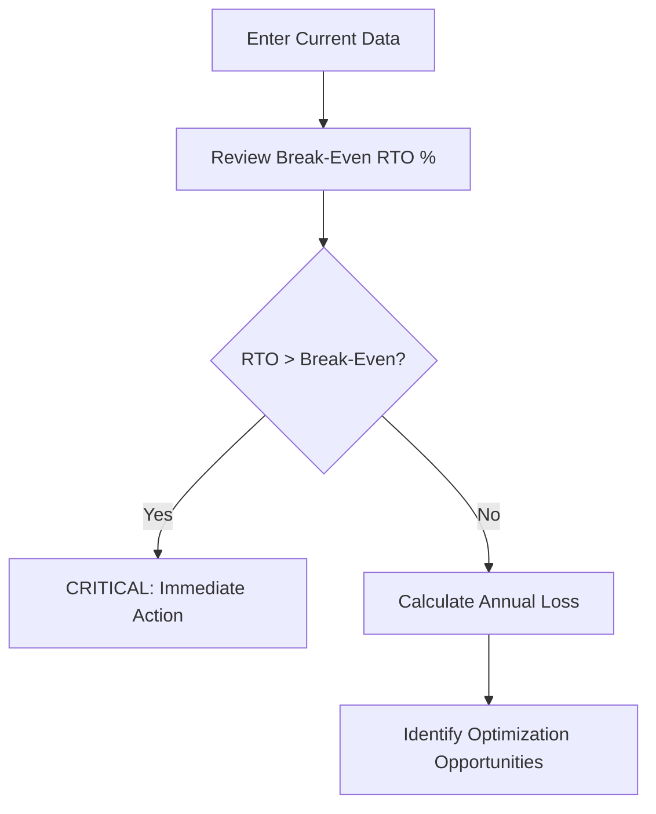
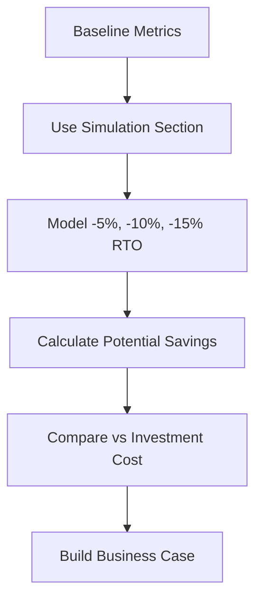
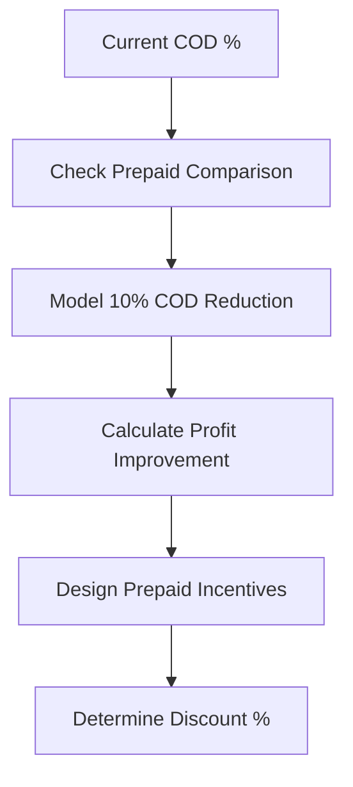

## Who Should Use the RTO Profit Simulator?

The RTO Profit Simulator is designed for anyone involved in e-commerce operations where COD (Cash on Delivery) is a significant payment method:

- **E-commerce Business Owners**: Understand the financial impact of RTO on profitability
- **Operations Managers**: Model the effect of operational improvements on bottom line
- **Finance Teams**: Quantify RTO losses for financial planning and investor reporting
- **Logistics Partners**: Demonstrate the value of RTO reduction services to clients
- **Marketplace Sellers**: Evaluate whether to offer COD on marketplaces

## Use Case 1: D2C Fashion Brand - Baseline Assessment

### Business Profile

**Brand**: StyleCraft (D2C Fashion)  
**Monthly Orders**: 10,000  
**Average Order Value**: ₹1,500  
**COD Percentage**: 60%  
**Current RTO**: 30%

### Using the Simulator

<Steps>
  <Step title="Input Current Business Metrics">
    Enter your actual operational data into the simulator. Use the default values as a starting point if you don't have exact numbers.
  </Step>
  
  <Step title="Review Financial Impact">
    The simulator calculates (based on `src/utils/calculations.js:12-56`):
    
    ```
    Total Revenue: ₹1,50,00,000/month
    COD Orders: 6,000
    RTO Orders: 1,800 (30% of COD)
    Total RTO Loss: ₹11,16,000/month
    Realized Revenue: ₹1,23,00,000
    Net Profit After RTO: ₹11,84,000/month
    ```
  </Step>
  
  <Step title="Check Break-Even RTO %">
    The simulator shows break-even RTO at **60.3%**. Since current RTO (30%) is below this, the business is profitable but losing significant potential revenue.
  </Step>
  
  <Step title="Annual Projection View">
    Toggle to "Annual Projection" to see yearly impact:
    - **Annual RTO Loss: ₹1,33,92,000**
    - This represents ~9% of total revenue lost to RTO
  </Step>
</Steps>

<Info>
**Key Insight**: While the business is profitable, reducing RTO from 30% to 20% would save **₹3,72,000/month** (₹44,64,000/year).
</Info>

## Use Case 2: New Seller - COD vs Prepaid Decision

### Business Profile

**Brand**: TechGadgets (Electronics Accessories)  
**Monthly Orders**: 2,000  
**Average Order Value**: ₹800  
**Decision**: Should we offer COD?

### Scenario A: 100% Prepaid (No COD)

```text
Monthly Orders: 2,000
Total Revenue: ₹16,00,000
RTO: 0 orders (prepaid has negligible RTO)
Net Profit: Higher margin but limited market reach
```

### Scenario B: 50% COD with Expected 25% RTO

<Steps>
  <Step title="Input Parameters">
    - Monthly Orders: 2,000
    - COD Percentage: 50%
    - Expected RTO: 25%
    - Forward/Return Shipping: ₹50 each
    - Product Cost: ₹300
  </Step>
  
  <Step title="Calculate Impact">
    ```
    Total Revenue: ₹16,00,000
    COD Orders: 1,000
    RTO Orders: 250
    RTO Loss: ₹1,00,000/month
    Net Profit After RTO: Lower but broader market access
    ```
  </Step>
</Steps>

<Tip>
**Decision Framework**: Offer COD if the incremental revenue from COD customers exceeds the RTO losses. Use the simulator's **Prepaid Comparison** section to model different COD adoption scenarios.
</Tip>

## Use Case 3: High-Volume Marketplace Seller

### Business Profile

**Seller**: HomeEssentials (Marketplace Multi-Category)  
**Monthly Orders**: 50,000  
**Average Order Value**: ₹600  
**COD Percentage**: 80% (marketplace mandate)  
**Current RTO**: 35%

### Critical Problem

<Warning>
At 35% RTO with high COD volume, this business is in the **Red Zone**. Let's analyze:

```text
Total Revenue: ₹3,00,00,000/month
COD Orders: 40,000
RTO Orders: 14,000
Monthly RTO Loss: ₹56,00,000
Annual RTO Loss: ₹6,72,00,000
```

**This represents 18.7% of revenue lost to RTO** - unsustainable for low-margin products.
</Warning>

### Using the Simulator for Optimization

<Accordion title="Step 1: Identify Break-Even Point">
The simulator calculates that with current margins, the break-even RTO is around 45%. While technically profitable, at 35% RTO there's minimal margin for other operational costs.
</Accordion>

<Accordion title="Step 2: Model RTO Reduction Scenarios">
Use the **Simulation Section** to see the impact of reducing RTO:

| RTO Reduction | New RTO % | Monthly Savings | Annual Savings |
|--------------|-----------|-----------------|----------------|
| -5%          | 30%       | ₹8,00,000       | ₹96,00,000     |
| -10%         | 25%       | ₹16,00,000      | ₹1,92,00,000   |
| -15%         | 20%       | ₹24,00,000      | ₹2,88,00,000   |
</Accordion>

<Accordion title="Step 3: Justify Verification System Investment">
If a ₹5,00,000/month verification system (IVR, OTP, address validation) can reduce RTO by 10%, the ROI is:

```text
Monthly Savings: ₹16,00,000
System Cost: ₹5,00,000
Net Monthly Benefit: ₹11,00,000
ROI: 220%
```

The simulator helps you present this business case to stakeholders.
</Accordion>

## Use Case 4: Premium Brand - Risk Mitigation

### Business Profile

**Brand**: LuxuryLiving (Home Decor)  
**Monthly Orders**: 1,500  
**Average Order Value**: ₹5,000  
**COD Percentage**: 30%  
**Current RTO**: 20%  
**Product Cost**: ₹2,000 (higher value products)

### Unique Considerations

<Note>
For high-value products, the **product cost component** of RTO is significant. Each RTO costs:

```text
RTO Loss per Order = ₹80 + ₹80 + ₹2,000 = ₹2,160
```

With 90 monthly RTOs (20% of 450 COD orders), that's **₹1,94,400/month** in losses.
</Note>

### Strategy Using the Simulator

1. **Model Partial COD Impact**: What if you require 20% advance payment for COD?
   - Reduces COD attractiveness to non-serious buyers
   - Simulator shows potential RTO reduction to 12-15%
   - Monthly savings: ₹50,000-₹80,000

2. **Selective COD by Pin Code**: Enable COD only for verified low-risk pin codes
   - Reduce COD percentage from 30% to 20%
   - Maintain RTO at 20% but for fewer orders
   - Lower total RTO loss while minimizing lost sales

<Tip>
Use the simulator's **AI Insights** feature to get automated recommendations based on your specific business parameters.
</Tip>

## Use Case 5: Seasonal Business - Annual Planning

### Business Profile

**Brand**: FestiveGifts (Seasonal E-commerce)  
**Peak Season**: 3 months (Oct-Dec)  
**Off Season**: 9 months  
**Variable Monthly Orders**: 500-20,000

### Why Annual View Matters

<Steps>
  <Step title="Calculate Peak Season Impact">
    During peak season (20,000 orders/month), with 70% COD and 35% RTO:
    
    ```
    Monthly RTO Loss: ₹30,80,000
    3-Month Peak Loss: ₹92,40,000
    ```
  </Step>
  
  <Step title="Calculate Off-Season Impact">
    During off-season (500 orders/month), with 50% COD and 25% RTO:
    
    ```
    Monthly RTO Loss: ₹77,500
    9-Month Off-Season Loss: ₹6,97,500
    ```
  </Step>
  
  <Step title="Use Annual View for Planning">
    Toggle to "Annual Projection" to see:
    
    ```
    Total Annual RTO Loss: ₹99,37,500
    ```
    
    This helps in:
    - Setting annual budgets
    - Planning logistics partnerships
    - Determining verification system investments
  </Step>
</Steps>

<Info>
**Planning Insight**: Invest in seasonal verification systems (OTP, call verification) **before** peak season starts. A 10% RTO reduction during peak season alone saves ₹30,80,000.
</Info>

## When to Use Monthly vs Annual View

### Use Monthly View When:

<Check>Analyzing current operational efficiency</Check>
<Check>Making month-to-month comparisons</Check>
<Check>Troubleshooting sudden RTO spikes</Check>
<Check>Evaluating short-term interventions</Check>
<Check>Presenting to operations teams</Check>

### Use Annual View When:

<Check>Planning yearly budgets and forecasts</Check>
<Check>Justifying capital investments in systems</Check>
<Check>Presenting to investors or board members</Check>
<Check>Calculating ROI for long-term strategies</Check>
<Check>Understanding total business impact</Check>

<Warning>
**Important**: The Annual View simply multiplies monthly metrics by 12. For seasonal businesses with variable monthly volumes, manually calculate different periods separately for accuracy.
</Warning>

## Common Simulation Workflows

### Workflow 1: Initial Assessment



### Workflow 2: Optimization Planning



### Workflow 3: Prepaid Conversion Strategy



## Key Takeaways

<CardGroup cols={2}>
  <Card title="Baseline Assessment" icon="chart-line">
    Use the simulator to understand your current RTO financial impact before making any changes
  </Card>
  
  <Card title="Scenario Modeling" icon="sliders">
    Model different improvement scenarios to justify investments in verification systems
  </Card>
  
  <Card title="Annual Planning" icon="calendar">
    Use Annual View for budgeting, investor presentations, and long-term strategy
  </Card>
  
  <Card title="ROI Calculation" icon="calculator">
    Compare potential savings from RTO reduction against the cost of implementing solutions
  </Card>
</CardGroup>

## Next Steps

<Tip>
Now that you understand how to apply the simulator to your business scenario, learn how to interpret each metric in detail.
</Tip>

<Card title="Interpreting Metrics" icon="gauge" href="/guides/interpreting-metrics">
  Deep dive into each calculated metric and what it means for your business
</Card>
